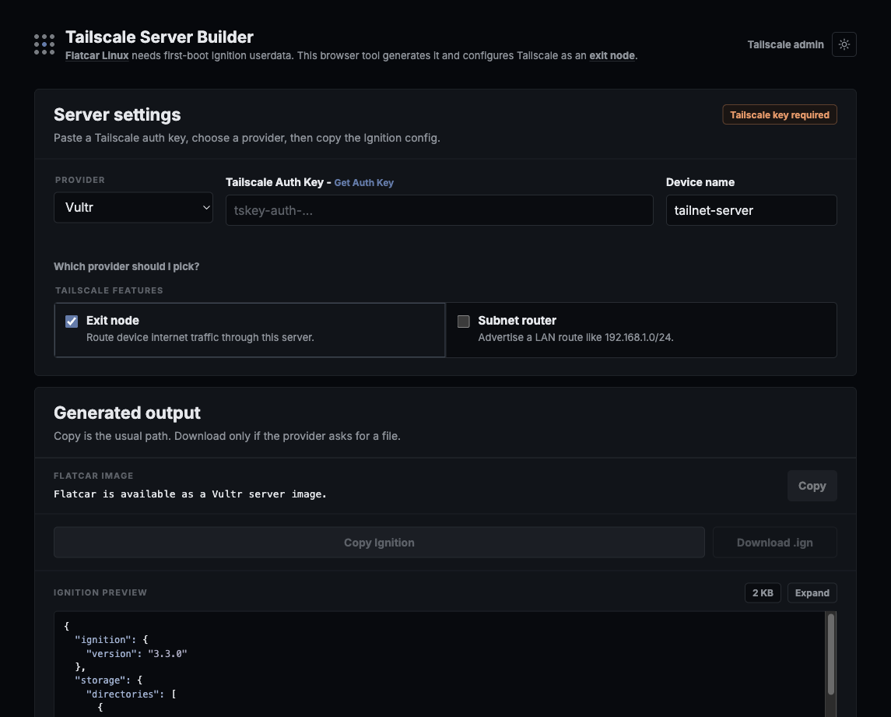

# Tailscale Server Builder

> This is not an official Tailscale project.

Generate Flatcar Ignition userdata for a small Tailscale exit node or subnet router. No build step, no provider API keys, or no local tooling required.

[Open the app](https://ironicbadger.github.io/flatcar-ignition-generator-tailscale/)

## Usage

1. Create a Tailscale auth key in [Tailscale Settings > Keys](https://login.tailscale.com/admin/settings/keys).
2. Open the app and paste the auth key.
3. Choose a provider and Tailscale features.
4. Copy the generated Ignition JSON into the provider userdata field.
5. Wait for the device to appear in the [Tailscale admin console](https://login.tailscale.com/admin).
6. Approve the exit node or subnet routes if your tailnet policy requires it.

## Providers

This repo doesn't endorse one provider over another, but Vultr ships Flatcar natively in some regions so it's the simplest choice for beginners.

- **Vultr:** lowest friction because Flatcar is available when creating a server.
- **DigitalOcean:** import the Flatcar `stable/current` image URL as a custom image first.
- **Hetzner:** create a Flatcar snapshot first, currently using `hcloud-upload-image`.
- **Netcup:** use a standard preset image (Ubuntu 24.04 recommended). The generated script installs Tailscale natively — no Flatcar image required.

## Disclaimers and info

- The generated Ignition file contains the auth key. Treat copied or downloaded configs as secrets.
- This is not an anonymity tool. Traffic exits from your VPS, and the provider still knows who owns it.
- This is not an official Tailscale app and is not affiliated with Vultr, DigitalOcean, Hetzner, Netcup, Flatcar, or Tailscale.
